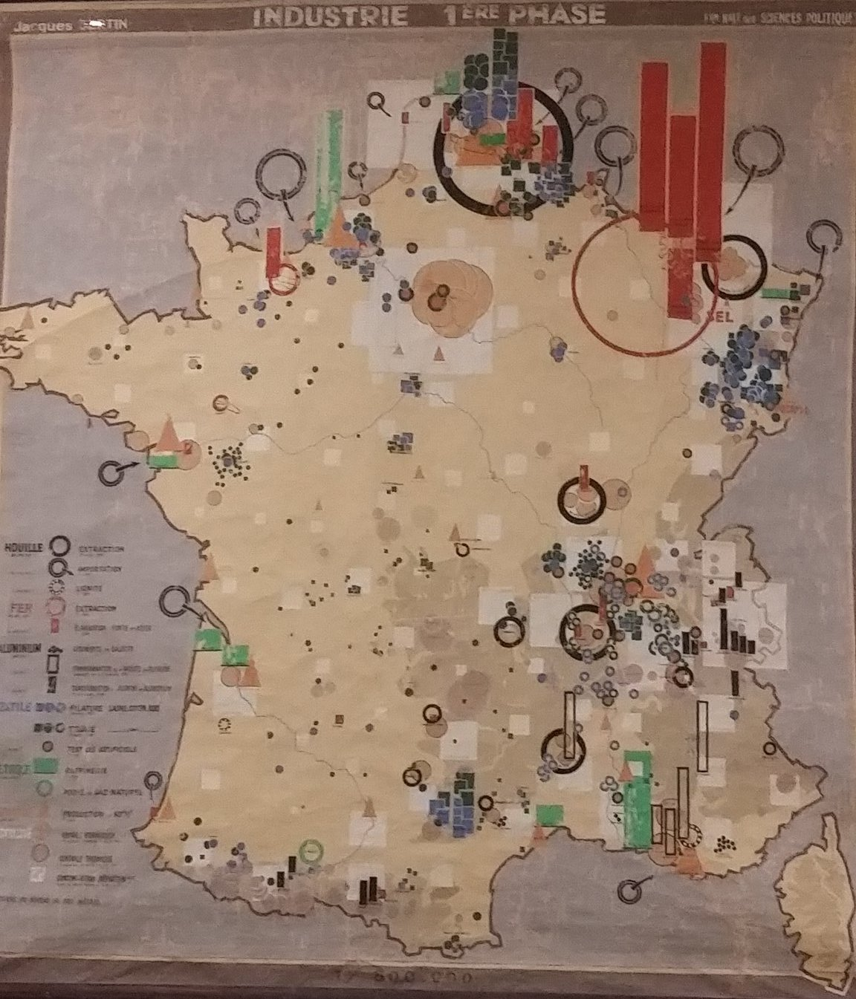
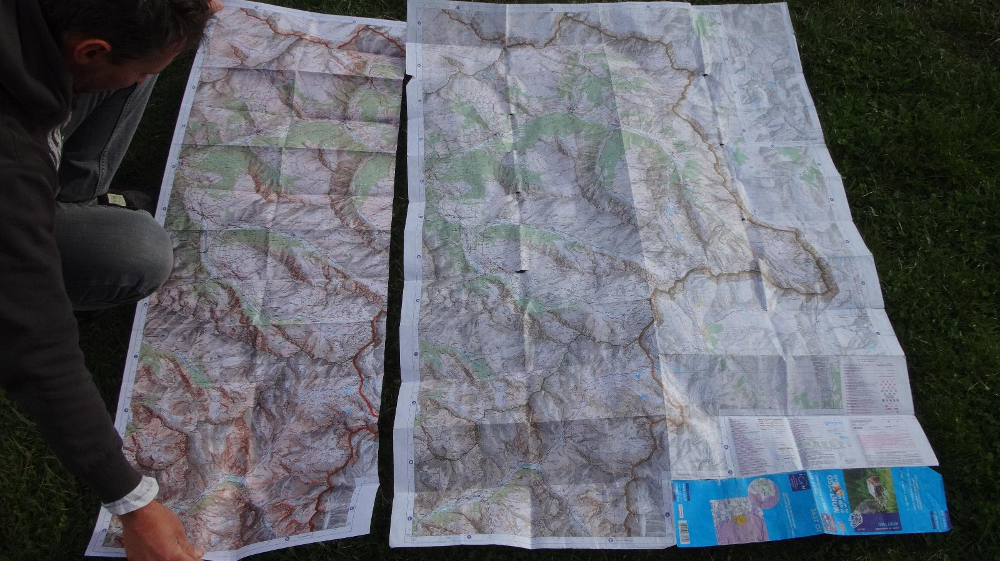
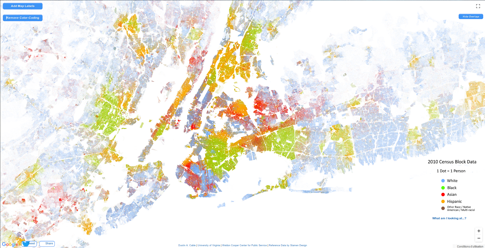
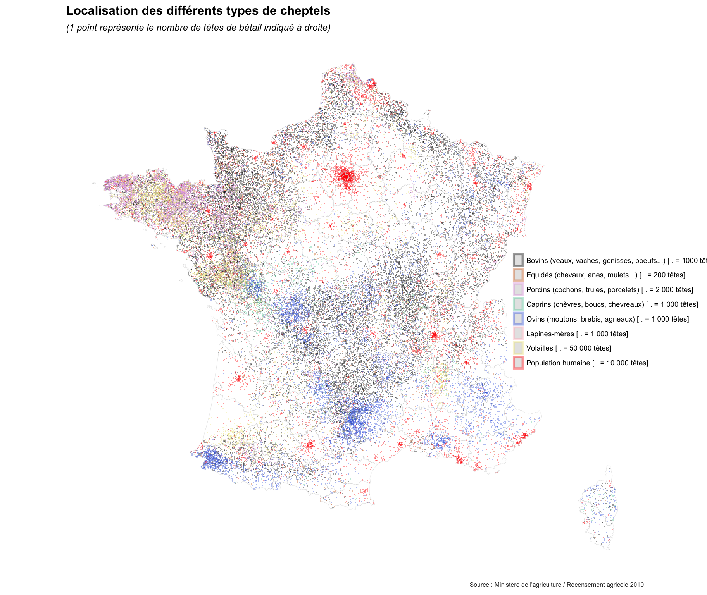

# De nouvelles représentations ?

## Cartographie traditionnelle {data-background="img/Bertin.jpeg" data-background-size="contain"}

## Qu'est-ce qui a changé ? 

[G. Palsky, 2017, @ Retrospective Bertin EHESS](https://twitter.com/GillesPalsky/status/930417402055155712)

## Pourquoi faire appel à de nouvelles représentations ?

Quels sont les changements qui pourraient demander la création de nouvelles pratiques cartographiques ?

>- De nouveaux modes d'acquisition des données
>- De nouvelles propriétés des données
>- Des pratiques d'utilisateurs ayant évoluées
>- De nouvelles attentes de la part des utilisateurs

# Changements dans les pratiques des utilisateurs

## De la carte papier à la carte numérique

----

### Un espace restreint

>- La carte doit être plus synthétique qu'auparavant
>- On ne peut plus prévoir les dimensions de lecture d'une carte

----

### Un support navigable

<iframe src="https://giphy.com/embed/zeBXGFy05ypdS" width="480" height="479" frameBorder="0" class="giphy-embed" allowFullScreen></iframe>

>- L'utilisateur s'attend à pouvoir zoomer et se déplacer dans une carte
>- La navigation doit être prévue et circonscrite.

## De la carte numérique à la carte interactive

<video data-autoplay data-src="img/maps_interaction.mp4" height="350"></video>

>- L'utilisateur est désormais habitué à explorer interactivement la carte
>- Il s'attend à ce qu'une carte lui propose différents fonds, des infobulles, de l'interactivité contextuelle (`onClick`, menus détails etc.)

----

## De la carte interactive aux cartes adaptatives

>- On ne peut plus prévoir une carte statique unique
>- Pour chaque carte réalisée, la lecture doit être pensée pour 3-4 supports...
>- ... et autant de modes d'interactions

## Nouveaux usages et réponses cartographiques adaptées

>- Nécessité de prévoir une combinaison importante de cas d'usages
>- On ne peut plus se contenter de peaufiner une carte "statique" adaptée à tout
> -  Les cartographies et géovisualisations doivent tirer parti des outils existants permettant de simplifier l'adaptatibilité à tout support : 
>      * Un support "universel" : les navigateurs internets
>      * Un formalisme "universel" : le combo "HTML<i class="fa fa-html5"></i>" :
        (HTML, CSS, JS + SVG)

# Le support cartographique évolue, mais n'implique pas pour autant de "nouvelles représentations", tout au plus de nouvelles pratiques.

## Mais les pratiques des utilisateurs ne sont pas les seules évolutions de cette dernière décennie :
>- #### Nouvelles sources de données :
>      * ##### Des données massives
>      * ##### Des données plus diverses
>      * ##### Des données plus rapides
> #### ==> de nouveaux besoins en représentation et en traitement.

# Des données massives

## Représentation

### Quelle hiérarchie visuelle ?

## Représentation

[B. Mericksay, 2017, Cartes & géomatique,vol. 229](https://halshs.archives-ouvertes.fr/halshs-01468314)

## Représentation
### The Racial Dot Map

[https://demographics.virginia.edu/DotMap/index.html](https://demographics.virginia.edu/DotMap/index.html)

## Représentation
### Heatmaps

[R. Cura, 2016, TimeLineEDB](http://shiny.parisgeo.cnrs.fr/TimeLineEDB/)

## Représentation
### Agrégation
<video data-autoplay data-src="img/FrancePixels.mp4" height="500"></video>

[E. Côme, 2014, France Pixels](http://www.comeetie.fr/galerie/francepixels/#splash)

## Représentation
### Clusters
<video data-autoplay data-src="img/clusters.mp4" height="500"></video>

## Représentation
### Lissage
<video data-autoplay data-src="img/aperitif.mp4" height="500"></video>

[H. Commenges, 2017, Apérit-IF](https://analytics.huma-num.fr/Hadrien.Commenges/aperitif/)

## Problèmes techniques
#### Pour l'affichage :
>- Les logiciels de SIG ne gèrent pas les données massives...
>- ... et les outils de DAO encore moins.
>- Impossible d'afficher des millions d'entités vectorielles sur un ordinateur lambda : SIG ou web
 
> => Quand le vecteur n'est pas possible :
>      * On agrège : Clusters, hexbins, densité etc.
>      * On rasterise : GeoServer, MapServer etc.
>      * Tuilage traditionnel (GeoServer, MapServer...) et plus moderne (Mapbox, CARTO, TileMill)

[B. Mericksay, ibid.](https://halshs.archives-ouvertes.fr/halshs-01468314)

## Problèmes techniques

### Traitement :
- Les logiciels de SIG ne gèrent pas les données massives...
- ... et les outils de DAO encore moins.

>- Les données massives sont difficilement manipulables hors environnements propres aux données :
>      * Pré-traitement des données : R, Python, filtres intra-API
>      * Mise en forme et requête des données : Idem + SQL

## Problèmes techniques {data-background="img/rpythonsql.jpg" data-background-size="contain"}

## Traitement + création

[P. Butler, 2010, Visualizing Facebook Friends](https://paulbutler.org/archives/visualizing-facebook-friends/)

# Des données hétérogènes

## Représentation

[M. Garnier (Matamix), 2017, Cartes à points pour bêtes à poils](https://mtmx.github.io/blog/carto_cheptels/)

### Comment donner une vision synthétique de la répartition de chaque type ?

## Représentation{data-background="img/mtmx2.png" data-background-size="contain"}
- Technique des "small-multiples"

## Représentation

[E. Côme, 2015, Bâti Paris](http://www.comeetie.fr/galerie/BatiParis/#12/48.8589/2.3491)

### Comment donner une vision synthétique de la répartition de chaque type ?

## Représentation
### Selection
<video data-autoplay data-src="img/parisbati.mp4" height="500"></video>
[E. Côme, 2015, Bâti Paris](http://www.comeetie.fr/galerie/BatiParis/#12/48.8589/2.3491)

>- Laisser l'utilisateur afficher ses propres classes

## Représentation
### Drill-down
<video data-autoplay data-src="img/drill_mapd.mp4" height="500"></video>
[Team MapD, 2016, Tweetmap](https://www.mapd.com/blog/2016/06/17/our-latest-tweetmap-innovation-streaming-content/)

>- Y compris de manière itérative

## Représentation
### Multiplier les informations
<video data-autoplay data-src="img/velib_multipt.mp4" height="500"></video>[E. Côme, 2013](http://www.comeetie.fr/galerie/velib/)

## Représentation
### Guider le lecteur

[E. Côme, 2014, France Pixels](http://www.comeetie.fr/galerie/francepixels/#splash)

## Représentation
### Guider le lecteur
<video data-autoplay data-src="img/got.mp4" height="500"></video>[Northwestern University Knight Lab, StoryMapsJS](https://storymap.knightlab.com/examples/aryas-journey/)

## Représentation
### Guider le lecteur

[Martino, Byrd & Spraggon, 2017, Where can North Korea’s missiles reach?](http://www.abc.net.au/news/2017-10-16/north-korea-missile-range-map/8880894)

## Représentation
### Laisser au lecteur le soin de comprendre lui-même les phénomènes cartographiés
<video data-autoplay data-src="img/mobiliscope.mp4" height="500"></video>[J. Vallée, C. Lecomte & al., 2017, Mobiliscope](http://mobiliscope.parisgeo.cnrs.fr/)

## Représentation
### Laisser explorer les données massives et hétérogènes
<video data-autoplay data-src="img/mapd_ships.mp4" height="500"></video>[M. McLintic, MapD, 2017, An interactive GPU-powered deep dive into 11.6 billion rows of US shipping data](https://www.mapd.com/blog/2017/08/22/an-interactive-deep-dive-into-11-6b-rows-of-us-shipping-data/)

## Problèmes techniques

>- Peu d'outils "clefs-en-main" pour créer des géovisualisation interactives...
>- ... besoin de passer par du développement.
>      * Javascript
   
>      * R  
>      * Python  

# Des données éphémères

## Retour sur la présentation des nouvelles sources

>- D'immenses flux de données en permanence
>- qui rendent les données rapidement obsolètes
>- => On n'est plus dans le paradigme de mise à jour décennalle autour des données INSEE
>      * La carte doit être évolutive simplement et rapidement
>      * La documentation ne suffit plus : toute la production d'une carte doit être un "workflow"
>      * Penser toute la construction de la carte en termes d'automatisation et reproductibilité
>      * Par génération automatique depuis des API, depuis des données standardisées etc.

# En guise de conclusion {data-background="img/Vermeer.jpeg" data-background-size="contain"}

## Merci de votre attention <i class="fa fa-map-o" aria-hidden="true"></i><i class="fa fa-globe" aria-hidden="true"></i><i class="fa fa-smile-o" aria-hidden="true"></i>

[D. Wood, 2003, Cartography is dead (thank God!)](http://makingmaps.owu.edu/mm/cartographydead.pdf)

