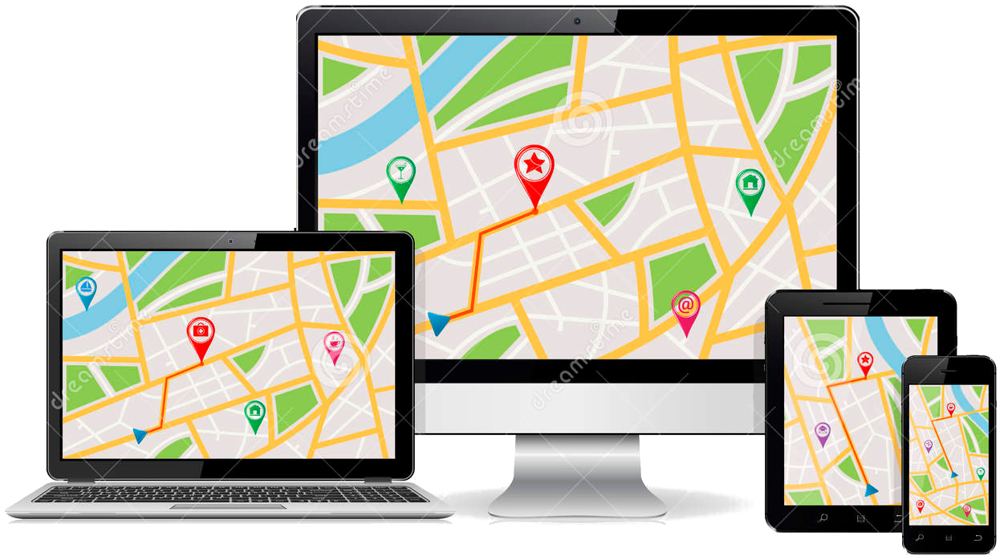
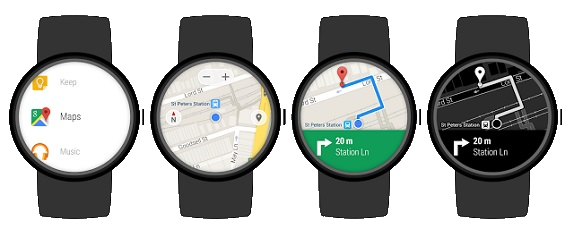
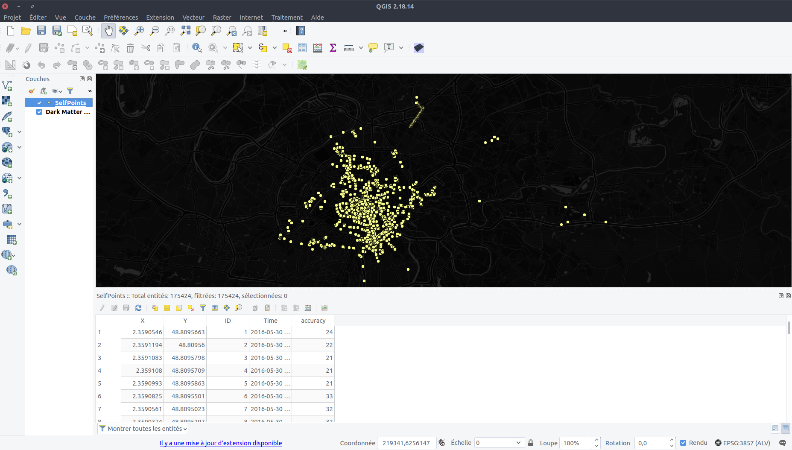
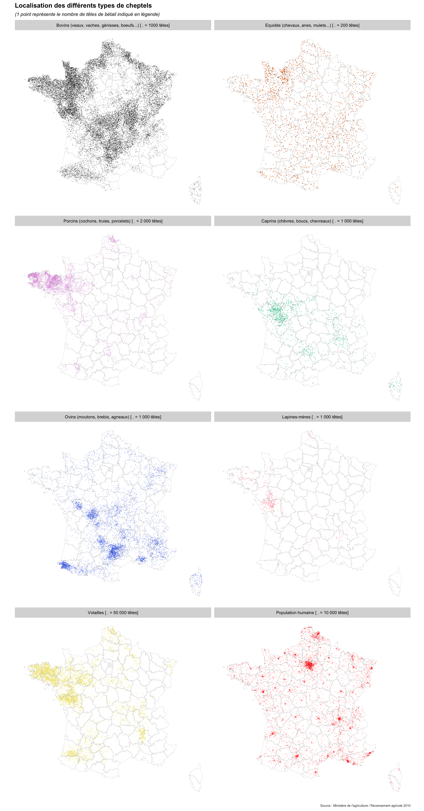
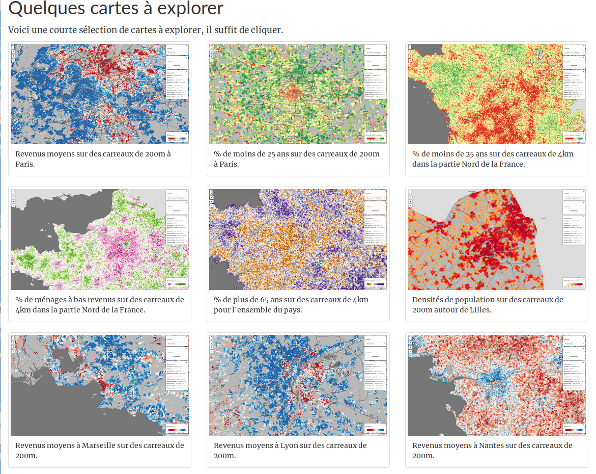

class: center, middle, inverse
```{r xaringan-themer, include = FALSE}
library(xaringan)
library(xaringanthemer) # devtools::install_github("gadenbuie/xaringanthemer")
mono_light(
  header_font_google = google_font("Josefin Sans"),
  text_font_google   = google_font("Montserrat", "300", "300i"),
  code_font_google   = google_font("Droid Mono"),
  outfile = "www/xaringan-themer.css")
```


# De nouvelles représentations ?

---

background-image: url(img/Bertin.jpeg)
background-size: 50%
background-position: 50% 70%
.footnote[
[G. Palsky, 2017, @ Retrospective Bertin EHESS](https://twitter.com/GillesPalsky/status/930417402055155712)
]
## Cartographie traditionnelle

---
background-image: url(img/Bertin.jpeg)
background-size: 50%
background-position: 50% 70%
 ## Qu'est-ce qui a changé ? 

.footnote[
[G. Palsky, 2017, @ Retrospective Bertin EHESS](https://twitter.com/GillesPalsky/status/930417402055155712)
]


---
## Pourquoi faire appel à de nouvelles représentations ?

### Quels sont les changements qui pourraient demander la création de nouvelles pratiques cartographiques ?

--

- #### De nouveaux modes d'acquisition des données

--

- #### De nouvelles propriétés des données

--

- #### Des pratiques d'utilisateurs ayant évoluées

--

- #### De nouvelles attentes de la part des utilisateurs

---
class: center, middle, inverse

# Changements dans les pratiques des utilisateurs

---

## De la carte papier à la carte numérique
.center[

]
---
## De la carte papier à la carte numérique
### Un espace restreint
.pull-left[

]
.pull-right[

]

--

- #### La carte doit être plus synthétique qu'auparavant

--

- #### On ne peut plus prévoir les dimensions de lecture d'une carte

---
## De la carte papier à la carte numérique
### Un support navigable

.pull-left[
<div style="width:100%;height:0;padding-bottom:100%;position:relative;"><iframe src="https://giphy.com/embed/zeBXGFy05ypdS" width="100%" height="100%" style="position:absolute" frameBorder="0" class="giphy-embed" allowFullScreen></iframe></div>
]

--

.pull-right[
- #### L'utilisateur s'attend à pouvoir zoomer et se déplacer dans une carte
- #### La navigation doit être prévue et circonscrite.
]

---
## De la carte numérique à la carte interactive

.center[
<video controls width="50%" autoplay>
<source src="img/maps_interaction.mp4" type="video/mp4">
</video>
]

--

- #### L'utilisateur est désormais habitué à explorer interactivement la carte

--

- #### Il s'attend à ce qu'une carte lui propose différents fonds, des infobulles, de l'interactivité contextuelle (`onClick`, menus détails etc.)


---
## De la carte interactive aux cartes adaptatives



--

- #### On ne peut plus prévoir une carte statique unique

--

- #### Pour chaque carte réalisée, la lecture doit être pensée pour 3-4 supports...

--

- #### ... et autant de modes d'interactions

---

## Nouveaux usages et réponses cartographiques adaptées

- #### Nécessité de prévoir une combinaison importante de cas d'usages

--


- #### On ne peut plus se contenter de peaufiner une carte "statique" adaptée à tout

--

- #### Les cartographies et géovisualisations doivent tirer parti des outils existants permettant de simplifier l'adaptatibilité à tout support : 
  * #### Un support "universel" : les navigateurs internets
  * #### Un formalisme "universel" : le combo "HTML5" : (HTML, CSS, JS + SVG)

---
class: middle, center, inverse

# Le support cartographique évolue, mais n'implique pas pour autant de "nouvelles représentations", tout au plus de nouvelles pratiques.

---

## Les pratiques des utilisateurs ne sont pas les seules évolutions de cette dernière décennie :

- #### Nouvelles sources de données :

  * #### Des données massives
  * #### Des données plus diverses
  * #### Des données plus rapides
#### => de nouveaux besoins en représentation et en traitement.


---
class: center, middle, inverse

# Des données massives

---
## Représentation

.center[

]

--

### Quelle hiérarchie visuelle ?

---
## Représentation

.center[

]

.footnote[
[B. Mericksay, 2017, Cartes & géomatique,vol. 229](https://halshs.archives-ouvertes.fr/halshs-01468314)
]
---
## Représentation
### The Racial Dot Map

.center[

]
.footnote[
[https://demographics.virginia.edu/DotMap/index.html](https://demographics.virginia.edu/DotMap/index.html)
]

---
## Représentation
### Heatmaps
.center[

]

.footnote[
[R. Cura, 2016, TimeLineEDB](http://shiny.parisgeo.cnrs.fr/TimeLineEDB/)
]

---

## Représentation
### Agrégation

.center[
<video controls width="80%" autoplay src="img/FrancePixels.mp4" ></video>
]

.footnote[
[E. Côme, 2014, France Pixels](http://www.comeetie.fr/galerie/francepixels/#splash)
]


---

## Représentation
### Clusters
.center[
<video controls width="80%" autoplay src="img/clusters.mp4" ></video>
]

---

## Représentation
### Lissage
.center[
<video controls width="75%" autoplay src="img/aperitif.mp4" ></video>
]

.footnote[
[H. Commenges, 2017, Apérit-IF](https://analytics.huma-num.fr/Hadrien.Commenges/aperitif/)
]

---

## Problèmes techniques

### Pour l'affichage :

--

- #### Les logiciels de SIG ne gèrent pas les données massives...

--

- #### les outils de DAO encore moins.

--

- #### Impossible d'afficher des millions d'entités vectorielles sur un ordinateur lambda : SIG ou web

---

## Problèmes techniques

### Pour l'affichage :

#### => Quand le vecteur n'est pas possible :
  * ##### On agrège : Clusters, hexbins, densité etc.
  * ##### On rasterise : GeoServer, MapServer etc.
  * ##### Tuilage traditionnel (GeoServer, MapServer...) et plus moderne (Mapbox, CARTO, TileMill)

.center[

]
.footnote[
[B. Mericksay, ibid.](https://halshs.archives-ouvertes.fr/halshs-01468314)
]


---
## Problèmes techniques

### Traitement :

- #### Les logiciels de SIG ne gèrent pas les données massives...
- #### et les outils de DAO encore moins.

--

- #### Les données massives sont difficilement manipulables hors environnements propres aux données :
  * #### Pré-traitement des données : R, Python, filtres intra-API
  * #### Mise en forme et requête des données : Idem + SQL

---
## Problèmes techniques

.center[

]

---

## Traitement + création
.center[

]

.footnote[
[P. Butler, 2010, Visualizing Facebook Friends](https://paulbutler.org/archives/visualizing-facebook-friends/)
]


---
class: center, middle, inverse
# Des données hétérogènes

---
## Représentation

.pull-left[


.footnote[
[M. Garnier (Matamix), 2017, Cartes à points pour bêtes à poils](https://mtmx.github.io/blog/carto_cheptels/)
]
]

--

.pull-right[

### Comment donner une vision synthétique de la répartition de chaque type ?
]

---
## Représentation

.pull-left[

]

.pull-right[
- #### Technique des "*small-multiples*"
]

---
## Représentation

.center[

]

.footnote[
[E. Côme, 2015, Bâti Paris](http://www.comeetie.fr/galerie/BatiParis/#12/48.8589/2.3491)
]

---
## Représentation - Selection

.center[
<video controls width="80%" controls autoplay src="img/parisbati.mp4"></video>
]
.footnote[
[E. Côme, 2015, Bâti Paris](http://www.comeetie.fr/galerie/BatiParis/#12/48.8589/2.3491)
]

--

- #### Laisser l'utilisateur afficher ses propres classes

---
## Représentation - Drill-down

.center[
<video controls autoplay src="img/drill_mapd.mp4" width="100%"></video>
]

.footnote[
[Team MapD, 2016, Tweetmap](https://www.mapd.com/blog/2016/06/17/our-latest-tweetmap-innovation-streaming-content/)
]

--

- #### Y compris de manière itérative

---
## Représentation - Multiplier les informations

.center[
<video controls autoplay src="img/velib_multipt.mp4" width="80%"></video>
]

.footnote[
[E. Côme, 2013](http://www.comeetie.fr/galerie/velib/)
]

---
## Représentation - Guider le lecteur

.center[

]

.footnote[
[E. Côme, 2014, France Pixels](http://www.comeetie.fr/galerie/francepixels/#splash)
]


---
## Représentation - Guider le lecteur

.center[
<video controls autoplay src="img/got.mp4" width="80%"></video>
]

.footnote[
[Northwestern University Knight Lab, StoryMapsJS](https://storymap.knightlab.com/examples/aryas-journey/)
]

---
## Représentation - Guider le lecteur

.center[

]

.footnote[
[Martino, Byrd & Spraggon, 2017, Where can North Korea’s missiles reach?](http://www.abc.net.au/news/2017-10-16/north-korea-missile-range-map/8880894)
]


---
## Représentation - Laisser au lecteur le soin de comprendre lui-même les phénomènes cartographiés

.center[
<video controls autoplay src="img/mobiliscope.mp4" width="80%"></video>
]

.footnote[
[J. Vallée, C. Lecomte & al., 2017, Mobiliscope](http://mobiliscope.parisgeo.cnrs.fr/)
]

---
## Représentation - Laisser explorer les données massives et hétérogènes

.center[
<video controls autoplay src="img/mapd_ships.mp4" width="80%"></video>
]

.footnote[
[M. McLintic, MapD, 2017, An interactive GPU-powered deep dive into 11.6 billion rows of US shipping data](https://www.mapd.com/blog/2017/08/22/an-interactive-deep-dive-into-11-6b-rows-of-us-shipping-data/)
]

---
## Problèmes techniques

- #### Quelques outils "clefs-en-main" pour créer des géovisualisation interactives...


.center[

<iframe width="100%" height="350px" src="https://www.youtube.com/embed/kgcJ0rftIUA" frameborder="0" allow="autoplay; encrypted-media; picture-in-picture" allowfullscreen></iframe>
]

---
## Problèmes techniques

- #### Quelques outils "clefs-en-main" pour créer des géovisualisation interactives...

.center[

<iframe width="100%" height="350px" src="https://www.youtube.com/embed/lto7Z5wC2hQ" frameborder="0" allow="autoplay; encrypted-media; picture-in-picture" allowfullscreen></iframe>
]


---
- #### Quelques outils "clefs-en-main" pour créer des géovisualisation interactives...
.center[
 
]

- #### mais pour une création plus personnalisée et durable, besoin de passer par du développement :

--

  * Javascript 


--
  * R 

--
  * Python 

---
class: middle, center, inverse

# Des données éphémères

---
## Retour sur la présentation des nouvelles sources

- #### D'immenses flux de données en permanence
- #### qui rendent les données rapidement obsolètes

--

- #### => On n'est plus dans le paradigme de mise à jour décennalle autour des données INSEE

--

  * #### La carte doit être évolutive simplement et rapidement
  * #### La documentation ne suffit plus : toute la production d'une carte doit être un "workflow"
  * #### Penser toute la construction de la carte en termes d'automatisation et reproductibilité
  * #### Par génération automatique depuis des API, depuis des données standardisées etc.

---
class: center, inverse
background-image: url(img/Vermeer.jpeg)
background-size: 50%
background-position: 50% 70%


# En guise de conclusion

---

« There’s a lot that cartographers have learned that is useful and valuable [...] but there’s a lot that was dead wood to begin with, and is so rotten today it’s threatening the rest of it.

All the prescriptive bullshit, every map must have a legend and a scale - all that - ignored in fact on a gazillion effective, useful maps, all that has to stop.

And design! Academic cartographers have never understood a thing - *not a thing* - about design. God knows that, as a group, the *least* interesting, *least* attractive, *least* significant maps have been made by university cartographers: all that *design talk*, from design illiterates, that’s got to stop. [...]

What would be helpful would be to offer professional *assistance*, on bended knee if necessary, to all the people trying to ameliorate their situation by mapping it.»
.center[
[D. Wood, 2003, Cartography is dead (Thank God!)](http://makingmaps.owu.edu/mm/cartographydead.pdf)
]

- #### Pour aller plus loin (*design* des fonds carto., carto interactive ...) :
  * #### [B. Mericskay - Visualisation de données spatiales sur le web - GeoViz 2018](https://geoviz.sciencesconf.org/data/pages/Visualisation_de_donnees_spatiales_sur_le_Web.pdf)
  * #### [E. Côme - (Géo)-visualisation et interactions quelques exemples - GeoViz 2018](http://www.comeetie.fr/partage/geoviz/)

